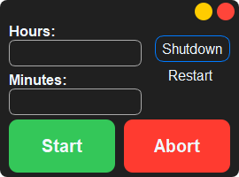

# [Shutdown Timer](https://dogukanurker.com/shutdowntimer) ⌛💤

Simple app to **shutdown** or **restart** your computer **whenever** you want.

## Installation

download source code from github 💾
`git clone https://github.com/DogukanUrker/ShutdownTimer.git`

go to directory 📁
`cd ShutdownTimer`

install requirements.txt 🔽
`pip install -r requirements.txt`

its ready to run 🎉
`python ShutdownTimer.py`
or [**download**](https://github.com/DogukanUrker/shutdowntimer/releases/download/v1/ShutdownTimer.exe) .exe
